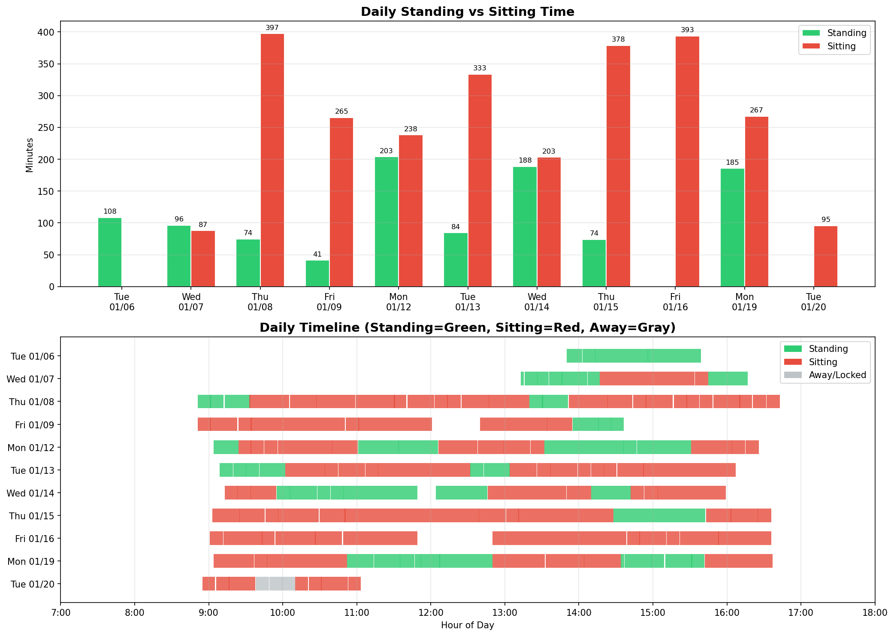

# DeskViz

A simple Python script to visualize standing desk usage data, plus a shell script to log desk height from a Linak standing desk.

## Requirements

- Python 3.6+
- matplotlib
- [linak-controller](https://github.com/rhyst/linak-controller) (for logging)

```bash
pip install matplotlib
```

## Data Collection

The `desk.sh` script controls the desk and logs height data:

```bash
./desk.sh stand    # Move desk to standing position
./desk.sh sit      # Move desk to sitting position
./desk.sh status   # Log current height to CSV (or 0mm if screen is locked)
```

By default, data is logged to `~/desk.csv`. Use `-f` to specify a different file:

```bash
./desk.sh -f /path/to/data.csv status
```

### Office Detection

The script only logs data when you're at your office desk. It detects this by checking for a specific USB ethernet adapter via its MAC address:

```bash
OFFICE_ETH_MAC="20:7b:d2:97:e4:74"
```

To configure for your setup:

1. Connect your office USB ethernet/dock
2. Find its MAC address:
   - Linux: `ip link`
   - macOS: `ifconfig`
3. Update `OFFICE_ETH_MAC` in `desk.sh`

This works cross-platform (Linux and macOS) and prevents logging when working from home or elsewhere.

Additionally, when the screen is locked, the script logs an "away" state (0mm) instead of the actual desk height. Screen lock is detected via DBus on Linux (GNOME, KDE, etc.) and Quartz on macOS.

### Automated Logging (Linux)

Use a systemd user timer to run `desk.sh status` periodically.

**1. Create the service file** (`~/.config/systemd/user/desk-status.service`):

```ini
[Unit]
Description=Log desk height to CSV

[Service]
Type=oneshot
ExecStart=%h/bin/desk status
```

**2. Create the timer file** (`~/.config/systemd/user/desk-status.timer`):

```ini
[Unit]
Description=Log desk height every 10 minutes

[Timer]
OnBootSec=1min
OnUnitActiveSec=10min

[Install]
WantedBy=timers.target
```

**3. Enable and start the timer:**

```bash
systemctl --user daemon-reload
systemctl --user enable --now desk-status.timer
```

**4. Check status:**

```bash
systemctl --user status desk-status.timer
systemctl --user list-timers
```

**5. Disable the timer:**

```bash
systemctl --user disable --now desk-status.timer
```

Note: The service assumes `desk.sh` is symlinked to `~/bin/desk`. Adjust the `ExecStart` path if your setup differs.

### Automated Logging (macOS)

Use launchd to run `desk.sh status` periodically. Create `~/Library/LaunchAgents/com.user.desk-status.plist`:

```xml
<?xml version="1.0" encoding="UTF-8"?>
<!DOCTYPE plist PUBLIC "-//Apple//DTD PLIST 1.0//EN" "http://www.apple.com/DTDs/PropertyList-1.0.dtd">
<plist version="1.0">
<dict>
    <key>Label</key>
    <string>com.user.desk-status</string>
    <key>ProgramArguments</key>
    <array>
        <string>/bin/bash</string>
        <string>-c</string>
        <string>$HOME/bin/desk status</string>
    </array>
    <key>StartInterval</key>
    <integer>600</integer>
    <key>RunAtLoad</key>
    <true/>
</dict>
</plist>
```

**Enable:** `launchctl load ~/Library/LaunchAgents/com.user.desk-status.plist`

**Disable:** `launchctl unload ~/Library/LaunchAgents/com.user.desk-status.plist`

## Visualization

Run the visualization:

```bash
python3 visualize_desk.py                    # Uses ~/desk.csv
python3 visualize_desk.py /path/to/data.csv  # Custom CSV path
```

The script outputs:
- Summary statistics to the terminal
- `<filename>_visualization.png` (e.g., `desk_visualization.png`)

### CSV Format

The CSV file should have the following format:

```csv
timestamp,height_mm
2026-01-06T13:50:38+01:00,1120
2026-01-06T14:03:06+01:00,740
```

- `timestamp`: ISO 8601 datetime
- `height_mm`: Desk height in millimeters (>=900mm = standing, <900mm = sitting, 0mm = away/screen locked)

## Example Output



The visualization shows:
- **Top**: Daily comparison of standing vs sitting time (minutes)
- **Bottom**: Timeline view of each day showing standing (green), sitting (red), and away/locked (gray) periods
